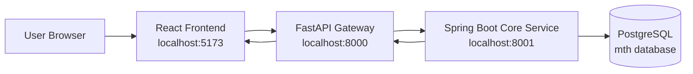

# Micro Task Hub Architecture Guide

## Overview

Micro Task Hub is split into three apps that work together:

- React frontend for the browser UI
- FastAPI gateway as the request relay
- Spring Boot core service for business logic and database access

The database is PostgreSQL.

## Architecture Diagram

## Request Flow

### Signup

1. User fills the signup form in React.
2. React sends JSON to `POST /authservice/signup`.
3. FastAPI validates the body with `SignupSchema`.
4. FastAPI forwards the request to Spring Boot at `POST /user/signup`.
5. Spring Boot checks whether the email already exists.
6. Spring Boot saves the new user in PostgreSQL.
7. The JSON response goes back through FastAPI to React.

### Signin

1. User enters email and password.
2. React sends JSON to `POST /authservice/signin`.
3. FastAPI forwards it to `POST /user/signin`.
4. Spring Boot checks the credentials in PostgreSQL.
5. If valid, Spring Boot generates a JWT token.
6. React stores the token in `localStorage` and navigates to `/home`.

### Home and Profile

1. React reads the token from `localStorage`.
2. React calls `GET /authservice/uinfo` to load user information.
3. FastAPI forwards the token to Spring Boot `GET /user/uinfo`.
4. Spring Boot reads the user, role, and menu data.
5. React renders the home menu and profile screen.

## Why The Gateway Exists

The gateway is a middle layer. It makes the frontend talk to one public API while Spring Boot keeps the actual business logic and database rules.

This setup also makes it easier to add more services later.

## Port Map

- React frontend: `5173`
- FastAPI gateway: `8000`
- Spring Boot backend: `8001`
- PostgreSQL: `5432`

## What Each Layer Owns

### React

- UI
- form state
- client-side validation
- routing
- token storage

### FastAPI

- request validation with Pydantic
- CORS for the browser
- forwarding requests to Spring Boot

### Spring Boot

- user creation
- signin checks
- JWT generation and validation
- menu and profile data lookup
- database interaction

### PostgreSQL

- persistent storage for users, roles, and menus
